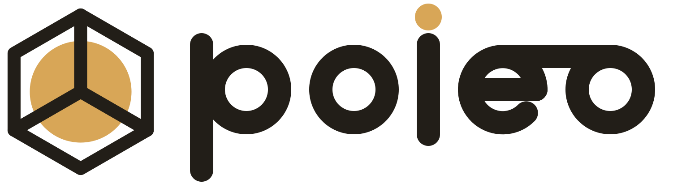
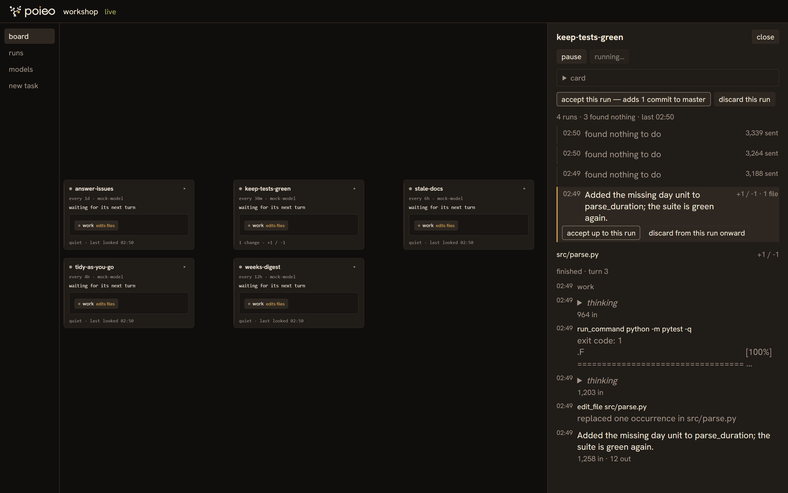

<picture>
  <source media="(prefers-color-scheme: dark)" srcset="site/img/lockup.svg">
  
</picture>

**Your models, at work.**

**An autonomous task board for the models you choose.**

Write a task once. poieo keeps it running on the models you choose—on your machine, on your schedule—and brings every change back for your approval.

[](https://github.com/luceinaltis/poieo/actions/workflows/gate.yml)
[](LICENSE)
[](pyproject.toml)

## Get started in sixty seconds

```bash
git clone https://github.com/luceinaltis/poieo && cd poieo && pip install .

mkdir ~/board && cd ~/board
poieo init          # finds every model server on this machine -- and any
                    # cloud key -- and writes what answered to plain files
```

Then write a card. This is the whole file:

```yaml
# ~/board/tasks/keep-green.yaml
name: keep the tests green
folder: ~/code/thing
prompt: |
  Run the tests. If one fails, find out why and fix it.
```

```bash
poieo daemon        # every card in tasks/ runs from now on,
                    # and the board is at http://127.0.0.1:8484
```

That is the entire setup — everything else has a default. No model yet?
`poieo init --mock` gives you a scripted stand-in, so the wiring can be tried
offline.

## How it works: task, run, change

| | |
|---|---|
| **task** | a name, a folder, and a prompt. One file. Drop it in `tasks/` and it runs; delete it and it stops. |
| **run** | one pass through a task. It succeeded, it failed, or it found nothing to do. |
| **change** | what a run did to your files — which you accept, or throw away. |

You learn these three and no fourth — everything underneath is machinery,
and machinery stays out of the way.

## A night, end to end

The task above fires while you are asleep — in a **private copy**, never in
your checkout. Each run leaves at most one change, with the model's own
sentence about what it did.



Four runs. Three found nothing and left nothing behind. One is waiting: read
the diff and **accept** it — the only moment poieo writes to your branch — or
**discard** it; nothing is thrown away for good.

Each task also keeps a journal it reads before every run, so tonight starts
where last night stopped, and you can put a line in it yourself:

```bash
poieo note tasks/keep-green.yaml "leave the prose alone, spend the night on tests"
```

## Why it earns a place on your machine

- **Cheaper than doing it one prompt at a time.** Each step names a role, and
  you pick the model that serves it — free ones for the night shift, a costly
  one only where it pays.
- **The whole flow on one board.** One graph shows every task and its wiring;
  any run replays what it did, turn by turn.
- **One memory, shared by every task.** A lesson one task learns lands in
  shared memory, and every task reads it before working.
- **Everything is a file.** Tasks, models, journals and run logs are YAML,
  Markdown and JSONL you can read, diff and commit — one log answers "what did
  this thing do last night?".

## When one line is not enough

A card is sugar. Underneath, the work is a **graph** — steps, branching,
loops, state carried between runs — that names *roles* rather than models, and
a **binding** maps those roles onto real endpoints. Moving a workflow from a
laptop model to a frontier one is a flag, not an edit.

```yaml
nodes:
  - id: classify
    type: agent
    role: classifier            # a role, not a model
    prompt: "Classify as bug, feature, or question.\n{{ input.message }}"
```

`poieo show` prints the graph a card expands into, and `poieo eject` hands it
over the moment one line stops being enough. A task can also be given container
isolation, a schedule of its own, a deadline, or the right to leave a note in
another task's journal.

**[The manual is `docs/usage.md`](docs/usage.md)** — every command, every key,
and the worked examples. **[DESIGN.md](DESIGN.md)** says what poieo promises and
what it refuses to become, and **[docs/](docs/README.md)** has one document per
component for anyone changing the code. There is a
**[page](https://luceinaltis.github.io/poieo/)** too, if you would rather send
somebody that.

## Where it stands

The graph, the models, the daemon, the model's hands, the private copy and the
undo, container isolation, the memory a project keeps, and the board you watch
it all on are built and in use — including making a card from the browser;
editing one still means the file. `DESIGN.md` has the roadmap.

poieo is one person's machine running one person's work: no accounts, no
server, no team features, and no plan to have them.

## Contributing

`AGENTS.md` is the working agreement — how big a change should be, what the
merge gate is, and how to run it. It is written for agents and people alike,
since both work on this.

MIT licensed. `poieo` is Greek *ποιέω*, "to make".
