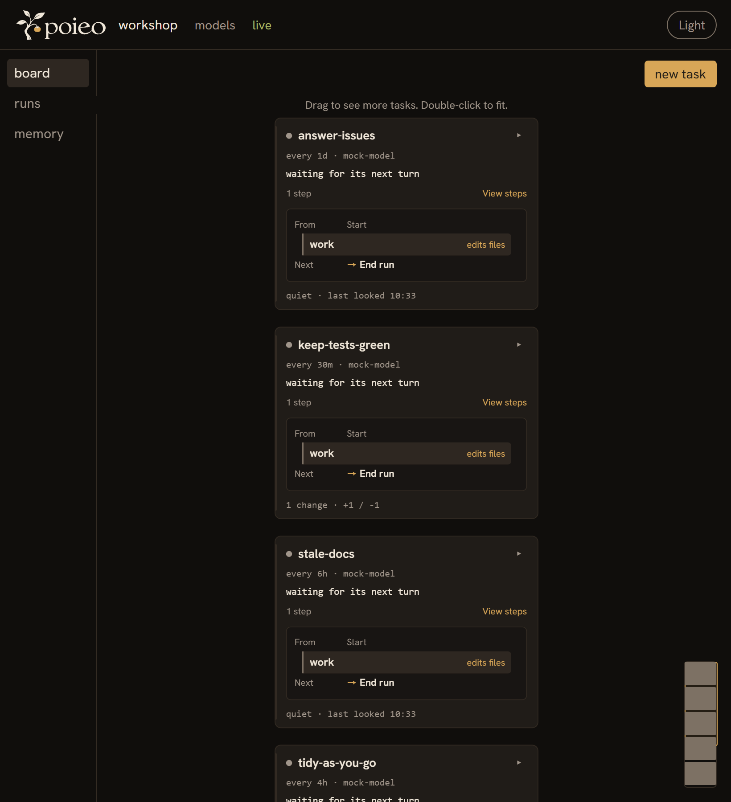

<picture>
  <source media="(prefers-color-scheme: dark)" srcset="site/img/lockup.svg">
  
</picture>

**Write down the work you want done. The models on your own machine keep it
running, and you read what they did in the morning.**

[](https://github.com/luceinaltis/poieo/actions/workflows/gate.yml)
[](LICENSE)
[](pyproject.toml)



Five tasks on the board. Each one is a card you wrote — a name, a folder, and
a sentence saying what to do — and a daemon on your own machine keeps them
running against a local model, around the clock, for nothing per token.

## Sixty seconds

```bash
git clone https://github.com/luceinaltis/poieo && cd poieo && pip install .

mkdir ~/board && cd ~/board
poieo init          # looks at this machine once: Ollama, LM Studio, vLLM,
                    # llama.cpp, a Claude key -- and writes down what answered
```

Then write a card. This is the whole file:

```yaml
# ~/board/tasks/keep-green.yaml
name: keep the tests green
folder: ~/code/thing
prompt: |
  Run the tests. If one fails, find out why and fix it.
```

```bash
poieo daemon        # every card in tasks/ runs from now on,
                    # and the board is at http://127.0.0.1:8484
```

That is the entire setup. Everything else — which model serves the card, how
often it fires, where the output goes — has a default, and is a line you add
only when you want it different.

No model on the machine yet? `poieo init --mock` lays the same project out with
a stand-in that answers from a script, so the wiring can be tried offline and a
real model bound later.

## Three words

You learn three, and there is no fourth.

| | |
|---|---|
| **task** | a name, a folder, and a prompt. One file. Drop it in `tasks/` and it runs; delete it and it stops. |
| **run** | one pass through a task. It succeeded, it failed, or it found nothing to do. |
| **change** | what a run did to your files — which you accept, or throw away. |

Everything underneath is machinery, and machinery stays out of the way.

## A night, end to end

The task above fires while you are asleep. It does **not** work in your
project: it works in a private copy of it, so the checkout you left open is
exactly as you left it in the morning. Each run leaves at most one change, with
the model's own sentence about what it did. (That copy is a git worktree, so a
folder git does not track has nothing to copy and nothing to undo — `poieo
tasks` says so up front rather than at 3am.)


Four runs. Three found nothing worth doing and left nothing behind. One edited
a file, and that one is waiting: read the diff, then **accept this run** — which
is the only moment poieo ever writes to your own branch — or **discard** it,
recoverably.

Each task also keeps a journal it reads before every run, so tonight starts
where last night stopped, and you can put a line in it yourself:

```bash
poieo note tasks/keep-green.yaml "leave the prose alone, spend the night on tests"
```

## Why it runs on your machine

- **Local models first.** A resident that costs nothing per token can be left
  running. Cloud models plug into the same mechanism as an option, never as a
  requirement.
- **Files, not a database.** Tasks, models, journals and run logs are YAML,
  Markdown and JSONL you can read, diff and commit. Nothing is true because an
  index says so.
- **Nothing touches your files until you accept it.** Autonomy without undo is
  a different, scarier product.
- **Every run is auditable.** Which model answered, which branch it took, which
  files it touched, which commands it ran, what it cost — one log file answers
  "what did this thing do last night?".

## When one line is not enough

A card is sugar. Underneath, the work is a **graph** — steps, branching,
loops, state carried between runs — that names *roles* rather than models, and
a **binding** maps those roles onto real endpoints. Moving a workflow from a
laptop model to Claude Opus is a flag, not an edit.

```yaml
nodes:
  - id: classify
    type: agent
    role: classifier            # a role, not a model
    prompt: "Classify as bug, feature, or question.\n{{ input.message }}"
```

`poieo show` prints the graph a card expands into, and `poieo eject` hands it
over the moment one line stops being enough. A task can also be given container
isolation, a schedule of its own, a deadline, or the right to leave a note in
another task's journal.

**[The manual is `docs/usage.md`](docs/usage.md)** — every command, every key,
and the worked examples. **[DESIGN.md](DESIGN.md)** says what poieo promises and
what it refuses to become, and **[docs/](docs/README.md)** has one document per
component for anyone changing the code. There is a
**[page](https://luceinaltis.github.io/poieo/)** too, if you would rather send
somebody that.

## Where it stands

The graph, the models, the daemon, the model's hands, the private copy and the
undo, container isolation, the memory a project keeps, and the board you watch
it all on are built and in use — including making a card from the browser;
editing one still means the file. `DESIGN.md` has the roadmap.

poieo is one person's machine running one person's work: no accounts, no
server, no team features, and no plan to have them.

## Contributing

`AGENTS.md` is the working agreement — how big a change should be, what the
merge gate is, and how to run it. It is written for agents and people alike,
since both work on this.

MIT licensed. `poieo` is Greek *ποιέω*, "to make".
