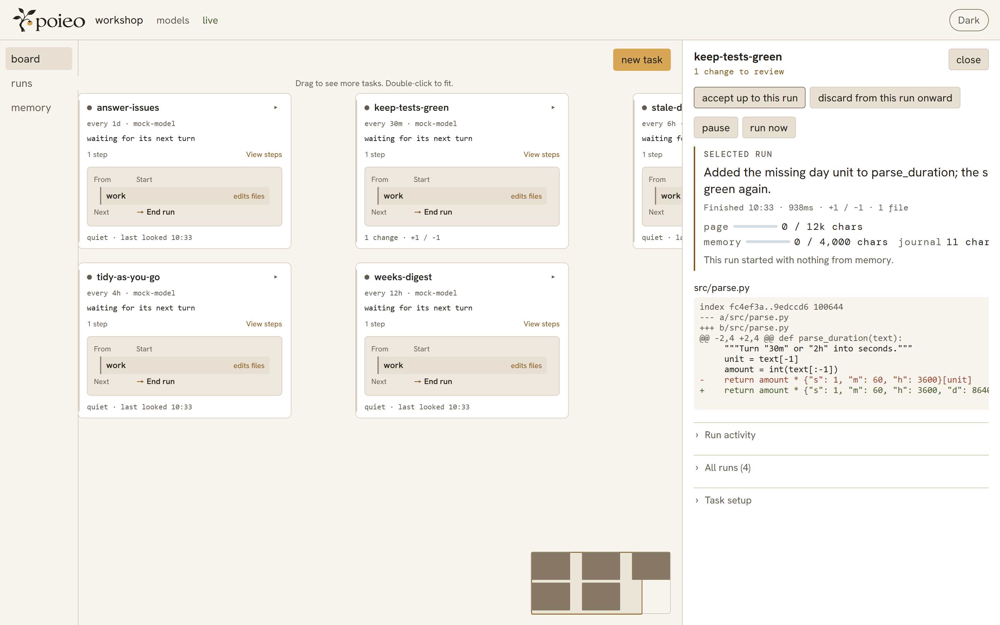

<picture>
  <source media="(prefers-color-scheme: dark)" srcset="site/img/lockup.svg">
  
</picture>

# Less spend. Better work.

**Small and large models, working together.**

Write a task. Choose its models. Let poieo keep it running.

[Website](https://luceinaltis.github.io/poieo/) · [Documentation](https://luceinaltis.github.io/poieo/docs.html) · [Get started](#start-with-one-task)

[](https://github.com/luceinaltis/poieo/actions/workflows/gate.yml)
[](LICENSE)
[](pyproject.toml)

## Every model has its place

Use small models for routine work and larger ones for demanding steps. Add
tests and review to judge the result. You choose the model for each step;
savings and accuracy depend on your models, tasks, and checks.

Models can run locally or through cloud APIs. Assign them to roles, then
change a model without rewriting the task. [Choose your models](docs/usage.md#choose-models).

## Set it running

| | |
|---|---|
| **task** | A folder, instructions, and a schedule. |
| **run** | One attempt, with its progress and results recorded. |
| **change** | File edits a run leaves for review in a Git project. |

Each task keeps a journal for its next run. Turn on project memory to share
learned context across tasks. Pause work, run it now, or leave a note.

<picture>
  <source media="(prefers-color-scheme: dark)" srcset="site/img/task.png">
  
</picture>

In a Git project, work happens in a **private copy**. Read the diff, then
**accept** or **discard** the change. A folder without Git is edited directly
and has no built-in review or undo.

## Start with one task

Install poieo and create a project with its offline scripted model:

```bash
git clone https://github.com/luceinaltis/poieo
cd poieo
pip install .

mkdir my-board
cd my-board
poieo init --mock
```

Save this as `tasks/keep-green.yaml`. Replace the folder with an existing Git
project on your machine:

```yaml
name: keep the tests green
folder: /path/to/your/git-project
prompt: |
  Run the tests. Find and fix a failing test.
  Run them again to check the change.
```

```bash
poieo daemon
```

Open the board at **http://127.0.0.1:8484**. The mock exercises the loop without
calling a real model; it does not actually repair your project. Follow the
[model setup guide](docs/usage.md#choose-models) to connect real models.

For a new project that should discover real models immediately, use
`poieo init` without `--mock`. It records reachable model endpoints and
credential variable names in plain files.

## When a task needs more steps

The browser can create tasks with several steps and conditions. Give each
model step a role; use small and large models where they help. Existing
graphs, advanced schedules, and isolation settings are edited in files.

`poieo show` displays a task's graph. `poieo eject` exports the full graph
when the short form is no longer enough. The
[self-improvement example](examples/improving-poieo/README.md) connects
reading, planning, building, and review.

poieo is a personal tool, with no accounts or team workspaces. The
[manual](docs/usage.md) covers everyday use. [DESIGN.md](DESIGN.md) records
product principles and the roadmap. For contributing, start with
[component documentation](docs/README.md) and [AGENTS.md](AGENTS.md).

MIT licensed. `poieo` is Greek *ποιέω*, “to make.”
