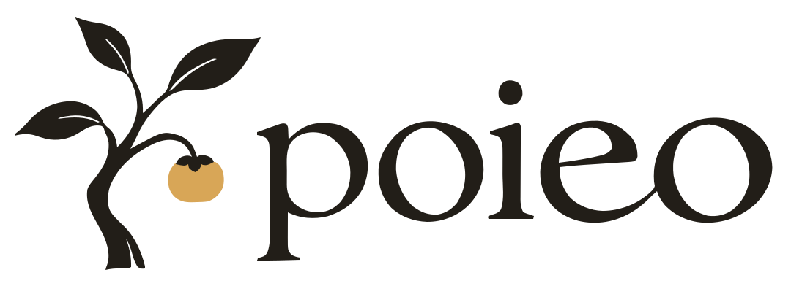

# The poieo brand

The selected direction pairs the wash-and-fruit design with the **persimmon
tree and serif poieo wordmark** in [`docs/branding.md`](../docs/branding.md).
The outlined SVG logo files are ready in [`logo/`](logo/poieo.svg), with a
[preview of the combinations](logo/preview.html). The sections below the logo
files describe the current site draft, including its original logo and green
palette; applying the selected identity to those pages remains a separate step.

## Selected logo files

<picture>
  <source media="(prefers-color-scheme: dark)" srcset="logo/poieo-reversed.svg">
  
</picture>

Every SVG has a transparent background and outlined lettering. There are no
embedded raster images, fonts, or external resources. All variants use the
same paths traced from the approved large lockup.

| combination | light background | dark background | one colour |
|---|---|---|---|
| Horizontal logo | [poieo.svg](logo/poieo.svg) | [poieo-reversed.svg](logo/poieo-reversed.svg) | [poieo-mono.svg](logo/poieo-mono.svg) |
| Symbol | [symbol.svg](logo/symbol.svg) | [symbol-reversed.svg](logo/symbol-reversed.svg) | [symbol-mono.svg](logo/symbol-mono.svg) |
| Wordmark | [wordmark.svg](logo/wordmark.svg) | [wordmark-reversed.svg](logo/wordmark-reversed.svg) | Same as the light version |

The colours are ink `#221e18`, gold `#d8a657`, and ivory `#f0e7d9` for reversed
ink. Preserve the aspect ratio and clear space built into the viewBox. Use the
symbol at 32 px wide or larger when its leaf detail and gold fruit must remain
clear. A 24 px rendering is shown in the preview for comparison.

The approved raster reference remains in
[`logo-persimmon-concept.png`](../docs/assets/branding/logo-persimmon-concept.png).
[`logo/source.json`](logo/source.json) records the source, crop, tracing settings,
and original generation prompt. The SVG paths are now the editable logo masters;
do not retrace the smaller generated specimens to create another variant.
Retired comparison images and old raster logo sources have been removed;
their history remains in git.

## Current site draft

**The right intelligence, in the right place.**

poieo is a personal tool for work that keeps going. Its distinguishing aim is
to combine small and large models for better accuracy at a lower cost: give
each step the capability it needs, preserve context, and inspect the result.
The Korean expression of this idea is **필요한 지능을, 필요한 만큼.**

The character is **precise, restrained, and clear**. A person should be able to
leave work running and return to an understandable result and a clear decision.
The product vocabulary remains **task, run, change**. Models are tools;
faces, employee names, and team avatars do not represent them.

## The promise

- **Headline:** The right intelligence, in the right place.
- **Descriptor:** Small and large models, working together.
- **Explanation:** Give routine work to a small model and demanding steps to a larger one. poieo keeps your tasks running, carries their context forward, and records the results.

You choose the model for each step. Current role assignments are explicit;
automatic cost or accuracy optimization is not a shipped capability. Savings
and accuracy depend on the task, models, and checks. Do not imply a benchmark,
invent a savings percentage, or treat a larger model as proof of correctness.
Cost is shown when the provider reports it or configuration supplies prices.

Explain the experience as **Write the task → Let it run → Review the change**.
Review before edits reach the checkout applies to Git-backed work. Non-Git
folders are edited directly. Project-wide learned memory is opt-in.

## Visual language

The current site uses the **original tree, golden fruit, and custom wordmark**,
including their original shapes and colours. The tree stands alone beside the
landing headline; navigation, the README, and the share image use the complete
tree-and-wordmark lockup. The selected replacement is the persimmon concept
linked in the Assets section below.

Let typography and space carry the page. Explain the combination of small and
large models in plain language, then show the real application. Do not turn the
logo into a model-routing diagram, add decorative node cards, or introduce a
second set of model symbols. Keep the emblem free of panels, labels, and effects.
Documentation gives the article the most space.

The landing page, docs viewer, README banner, and share image use this identity.
The installed board still uses its warm palette and the same original logo;
its layout and palette redesign are a separate product change.

## Colour

The public pages share `site/style.css`. Light mode uses a cool paper surface
and deep green ink. Dark mode reverses their weight. Green identifies the
primary action. The original logo keeps its ink (`#221e18`), ivory (`#f0e7d9`),
and golden fruit (`#d8a657`) in both themes.

| token | dark | light | purpose |
|---|---|---|---|
| Ground | `#14221b` | `#f3f5f2` | page |
| Panel | `#1b2e24` | `#ffffff` | raised reading surface |
| Well | `#112019` | `#e8ede6` | code background and product frame |
| Raised | `#294334` | `#dce7d8` | selected navigation |
| Rule | `#3c5445` | `#ccd6cb` | quiet separation |
| Line | `#95ad9e` | `#687d6a` | outlines and reading separators |
| Text | `#edf3e9` | `#203b2b` | primary text |
| Dim | `#b4c4b8` | `#536657` | supporting text |
| Ember | `#d5bc77` | `#876323` | secondary gold accent |
| Live | `#c4dda6` | `#3c7150` | active work |
| Stop | `#eda99a` | `#a34232` | failure |
| Accent | `#c4dda6` | `#285b3f` | primary buttons and links |
| On accent | `#203b2b` | `#f3f5f2` | text inside an accent shape |

## Type and layout

Hanken Grotesk carries headings, prose, and interface labels. DM Mono is for
code and exact data. Both are OFL and shipped under `site/fonts/`, with a system
fallback for other scripts. Do not rely on a font download for the page to work.

Headlines use a moderate weight, close spacing, and natural wrapping. Body
copy is at least 16px; routine labels are at least 14px. Use sentence case.
The landing page pairs the proposition with the original tree. Supporting sections
use unequal space for the claim and its explanation. Documentation keeps
navigation quiet, the article readable, and code horizontally scrollable.

## Assets

The current site assets use the original tree and custom wordmark. Their
lettering joins e and o; the crooked tree carries a single golden fruit.
These in-use files remain until the page update adopts the selected SVG files.

| asset | purpose |
|---|---|
| `site/img/lockup.svg`, `lockup-light.svg` | complete original logo in navigation, the README, and share image |
| `site/img/mark.svg`, `mark-light.svg` | original tree beside the landing headline |
| `site/img/favicon.svg`, `apple-touch-icon.png` | original tree for browser and device icons |
| `site/img/wordmark.svg`, `wordmark-light.svg` | original lettering when a separate wordmark is needed |
| `site/social.html`, `site/img/social.png` | shared 1280×640 image and its source |

The selected replacements are the outlined SVG files listed above. When the
pages are updated, derive their logos and browser icons from those files.
Forge imagery remains retired.
