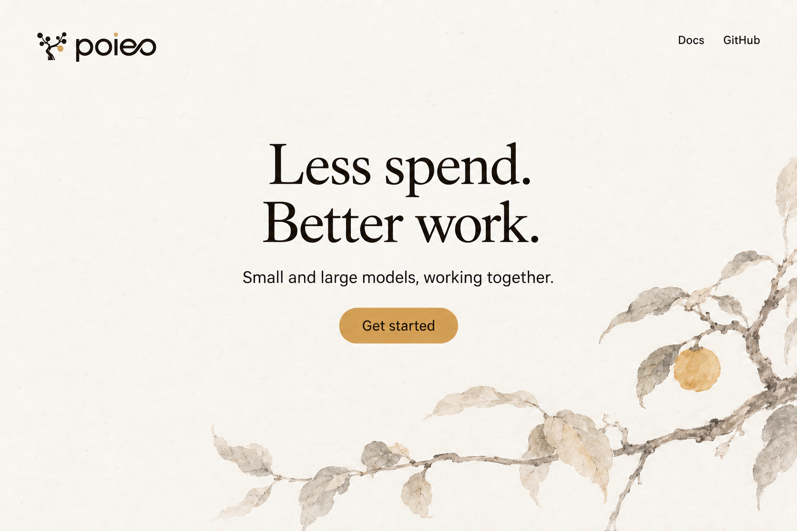

# poieo 브랜딩

브랜드의 목적, 문장, 색, 심벌을 함께 판단하기 위한 작업 문서다.
사용자가 정한 전제와 제안을 구분한다. **디자인 방향은 2안 ‘담채와 열매’로
선택했다. 영문 문구와 세부 서체는 시안이며, 현재 랜딩·문서 페이지·README에
아직 적용하지 않았다.**
제품의 실제 동작과 한계는 [DESIGN.md](../DESIGN.md)를 따른다.

## 정해진 전제

- 작은 모델과 큰 모델을 조합해 **적은 비용으로 높은 정확도**를 목표로 한다.
- 기존 **나무, 황금색 열매, 워드마크**를 유지한다.
- 첫 적용 범위는 랜딩, 문서 페이지, README다.
- 현재 시안은 문구가 장황하고 색이 로고와 어울리지 않는다.
- 장식용 모델 연결도는 사용하지 않는다.
- 조선 회화의 화풍을 가볍게 참고해 디자인 컨셉을 탐색한다.
- 디자인은 **2안 ‘담채와 열매’**, 공개 문구는 **영어**를 사용한다.

## 제안하는 브랜드의 핵심

**작은 비용으로, 제대로 된 결과를 꾸준히 만드는 도구.**

poieo를 개인이 자기 일을 계속 맡겨 두고, 나온 결과를 확인하며 쓰는
AI 작업 도구로 소개한다. 비용이 적게 들어 자주 돌릴 수 있고,
필요한 곳에 더 좋은 모델과 검증을 써서 결과를 개선하는 것이 지향점이다.

| 질문 | 답 |
|---|---|
| 누구를 위한가 | 자기 작업과 사용할 모델을 직접 정하고 싶은 개인 |
| 어떤 가치를 주는가 | 반복되는 일을 계속 처리하고, 확인할 수 있는 결과를 남긴다 |
| 무엇이 다른가 | 작은 모델과 큰 모델을 작업에 맞게 조합해 비용과 정확도를 함께 다룬다 |
| 어떤 인상인가 | 묵묵하고, 영리하고, 단정한 작업 도구 |
| 무엇으로 신뢰를 얻는가 | 실제 작업, 실행 기록, 검증 결과, 검토할 수 있는 변경 사항 |

작은 모델과 큰 모델의 조합은 이 가치를 만드는 방식이다. 첫인상에는
사용자가 얻는 결과를 먼저 놓고, 모델을 나누는 방법은 필요한 자리에서 설명한다.

정확도와 비용 절감은 목표다. 현재는 사용자가 단계별 모델을 선택한다.
자동으로 최적 모델을 고른다는 인상, 확인하지 않은 절감률, 정확도 보장은 쓰지 않는다.
실행 비용은 제공자나 설정에서 가격 정보를 얻을 수 있을 때 보여 준다.

## 문구

현재의 “The right intelligence, in the right place.”는 지능의 배치를
강조한다. 뒤따르는 부제와 본문, 다음 섹션까지 비슷한 설명을 반복하면서
poieo로 어떤 일을 할 수 있는지가 늦게 드러난다.

새 문장은 한 번에 한 가지를 말한다. 첫 화면에는 짧은 제목 하나,
제품 설명 한 문장, 시작 동작을 둔다. 실행 환경과 설정 방법은 뒤로 보낸다.

선택한 디자인에 맞춘 영문 문구 초안:

> **Less spend. Better work.**
>
> Small and large models, working together.
>
> Get started

제목은 시안에서 두 줄로 나눈다. 이 영문 문구는 확정 슬로건이 아니다.
비용과 결과를 먼저 말하고, 설명 한 문장에서 모델 조합을 전한다.

- 제목 아래에서 제목을 다시 풀어 말하지 않는다.
- “지능”, “가능성” 같은 추상어를 겹치기보다 실제 작업과 결과를 말한다.
- 기능 목록은 필요한 곳에 두고, 첫 화면에 약속을 여러 개 쌓지 않는다.
- 제품의 기본 말인 **task, run, change**를 유지한다.
- 랜딩은 제품을 이해하고 시작하는 곳, docs는 사용법을 찾는 곳,
  README는 무엇인지 확인하고 실행해 보는 곳으로 쓴다.

## 색

**로고에 이미 있는 먹색·아이보리·황금색을 중심으로 제안한다.**
현재 시안의 녹색 본문과 버튼, 차가운 바탕은 따뜻한 로고와 별개의 색 체계처럼
보인다. 새 팔레트는 기존 로고의 세 색에서 시작한다.

| 색 | 값 | 역할 |
|---|---|---|
| 먹색 | `#221e18` | 로고의 기존 색. 밝은 화면의 본문, 어두운 화면의 바탕 |
| 아이보리 | `#f0e7d9` | 로고의 기존 색. 보조 면, 어두운 화면의 본문 |
| 황금색 | `#d8a657` | 원래 열매의 색. 드문 강조와 핵심 동작 |
| 밝은 바탕 | `#f8f5ef` | 긴 글과 작업 내용을 담는 기본 면 |
| 보조 글자 | `#756d61` | 설명, 날짜 등 덜 강조할 정보 |

밝은 화면은 밝은 바탕과 먹색을 대부분 사용하고 금색을 소량 쓴다.
어두운 화면은 먹색 바탕과 아이보리 글자를 사용한다. 금색 버튼에는 먹색
글자를 놓는다. 밝은 바탕 위의 작은 글자를 금색으로 쓰지 않는다.

금색은 원래 열매와 이어지는 포인트다. 금속 광택, 금박 효과, 넓은 금색 면으로
고급스러움을 연출하지 않는다. 녹색과 빨간색은 성공·실패 같은 상태를
설명할 때만 사용한다. 실제 적용 때는 두 테마의 대비와 읽기 편한 정도를 확인한다.

## 심벌과 화면

원래 로고의 형태, 비례, 색을 보존한다. 심벌에 부여할 의미는
**이어지는 작업과 그 끝에 얻는 쓸모 있는 결과**로 제안한다.
나뭇가지나 열매마다 모델 역할을 붙이지 않는다.

로고는 헤더와 README에서 식별 가능한 크기로 쓴다. 큰 나무 심벌을
반복해서 배치할 필요는 없다. 브랜드 인상은 로고, 짧은 문장, 색의 일관성으로
만들고, 제품 설명에는 실제 작업 화면이나 확인 가능한 결과를 쓴다.

제목은 선택한 시안처럼 절제된 라틴 세리프를 시험한다. 구체적인 서체는
아직 선택하지 않았다. 현재 포함된 Hanken Grotesk는 본문과 버튼에,
DM Mono는 코드와 정확한 수치에 우선 유지한다. 워드마크를 본문 글꼴로 흉내 내지 않는다.
문구를 먼저 줄인 뒤 글자 크기와 여백을 정한다. docs에서는 본문 읽기를 우선한다.

## 조선 회화를 참고한 디자인 컨셉

### 선택한 방향 · 담채와 열매

가운데 정렬한 제목과 화면 가장자리에서 들어오는 옅은 가지를 조합한다.
먹의 농도를 낮추고 열매와 버튼에 황금색을 사용한다. 여백과 옅은 담채의
부드러운 인상을 유지한다. 그림은 첫 화면에 두고, 문서 본문과 작업 화면은
읽기 편하게 유지한다.

비교용 원본: [먹과 여백](assets/branding/joseon-ink-concept.png),
[담채와 열매 한글 시안](assets/branding/joseon-wash-concept.png).

참고 자료는 국립중앙박물관의 [김정희 《세한도》 해설](https://www.museum.go.kr/MUSEUM/contents/M0501000000.do?relicRecommendId=623104&schM=view)과
[조선 후기 수묵·담채 화조화 해설](https://www.museum.go.kr/MUSEUM/contents/M0501000000.do?relicRecommendId=269064&schM=view)이다.
여백, 먹의 농담, 옅은 채색을 현대 화면에 적용한 해석이며 특정 작품을 복제한 것은 아니다.

이미지는 ChatGPT Image로 원본 로고를 참조해 생성한 **방향 검토용 이미지**다. 생성 과정에서
로고의 세부나 글자 모양이 달라질 수 있으므로 실제 구현에는 기존 SVG를 그대로 쓴다.
종이 질감과 붓 느낌은 그림에 한정하고, docs의 본문 배경과 버튼은 깨끗하게 만든다.
담채의 분위기와 가운데 정렬은 선택한 방향이다. 영문 문구와 제목 글꼴은 아직 확정하지 않았다.

## 적용 상태

기존 로고 복원은 반영되어 있다. 공개 페이지의 현재 문구와 녹색 팔레트는
이 문서의 제안과 다르며 계속 검토 중이다.
[brand/README.md](../brand/README.md)는 현재 시안과 자산을 기록한다.
브랜드 방향을 채택해 화면을 수정할 때 이 문서, 자산 안내, 랜딩, docs,
README, 공유 이미지를 함께 맞춘다.
